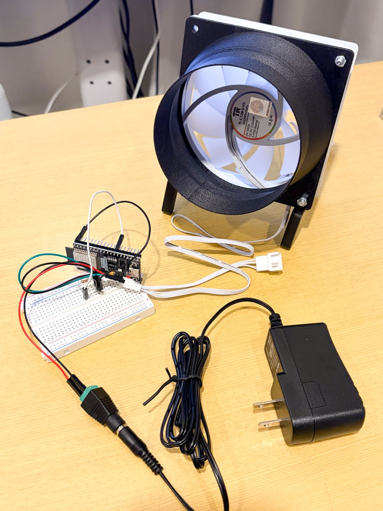

# WindLink

[English](README.md) | **日本語**

VRChatのアバター移動速度をOSCで受信し、USB接続したESP32を介して、現実の12V・4ピンPWMファンの風量をリアルタイムに変える試作プロジェクトです。



*動作確認に使用したWindLink試作機：120mm PWMファン、ESP32ブレッドボード制御回路、12V電源。*

> [!NOTE]
> 本プロジェクトのコード、Web UI、ドキュメントは、生成AIの支援を受けて作成・整理されています。配線と実機動作は人間が確認していますが、利用者自身でも内容を確認し、安全に配慮して使用してください。詳しくは「AI利用について」を参照してください。

```text
VRChat
  │ OSC / UDP 127.0.0.1:9001
  ▼
Python OSCモニター・HTTPサーバー
  │ JSON / HTTP 127.0.0.1:8766
  ▼
ブラウザーUI
  │ Web Serial / USB 115200 baud
  ▼
ESP32
  │ GPIO4 / 25kHz PWM / オープンコレクタ
  ▼
12V・4ピンPWMファン
```

## 必要な機材

### 必須ハードウェア

| 数量 | 機材 | 条件・用途 |
| ---: | --- | --- |
| 1 | ESP32開発ボード | 動作確認済み：Freenove ESP32 WROOM-32E（ESP32-WROOM-32E）。USBシリアル対応品 |
| 1 | 12V・4ピンPWM PCファン | 動作確認済み：120mm。4ピンのPin 4がPWM制御入力のもの |
| 1 | 12V DC電源 | ファンの定格電圧・最大電流を満たし、20〜30%程度の余裕があるもの |
| 1 | NPNトランジスタ | 動作確認済み：2SC1815GR。PWM信号をオープンコレクタ化するために使用 |
| 1 | 1kΩ抵抗 | 1/4W以上。ESP32 GPIOとトランジスタのBase間に使用 |
| 1 | ブレッドボード | 試作配線用 |
| 適量 | ジャンパーワイヤー・接続材 | GPIO、共通GND、ファンPWM信号の接続用 |
| 1 | USBデータケーブル | ESP32への書き込みとPCとのシリアル通信に使用。充電専用品は不可 |
| 1 | Windows PC | VRChat、Python、対応ブラウザー、Arduino IDEを実行できるもの |

12V電源の必要電流は、ファン本体のラベルまたはデータシートに記載された最大電流を基準に選びます。複数台を接続する場合は最大電流を合計してください。ファンの電力線に使う配線・コネクターも、その電流に対応したものが必要です。

### 必要なソフトウェア

| ソフトウェア | 用途 |
| --- | --- |
| VRChat | アバター移動パラメーターのOSC送信 |
| Python 3 | OSC受信・ローカルHTTPサーバー。外部パッケージ不要 |
| ChromeまたはEdge | Web SerialによるESP32接続 |
| Arduino IDE 2.x | ESP32ファームウェアの書き込み |
| Arduino ESP32 Core 3.x | ESP32向けビルド。動作確認済み：3.3.11 |

## 最短セットアップ

公開中の最終画面は[`index.html`](index.html)をブラウザーで開いて確認できます。この公開リポジトリは、最終Webビュー、技術README、写真、ライセンスだけの最小構成です。実機で使用したOSCブリッジとESP32ファームウェアは、動作確認済みアーキテクチャとして本READMEに仕様を残していますが、ファイル自体は配布していません。

画面はライブOSC表示に元プロトタイプのローカルAPI `/api/state` を必要とします。ブリッジがない場合は静的なUIプレビューとして表示されます。Web Serial操作には、対応ブラウザーと後述のシリアルプロトコルを実装したESP32が必要です。

## 現在使用しているハードウェア

### ESP32

現在実機で使っているのは、ピンヘッダー実装済みの **Freenove ESP32 WROOM-32E** です。

- MCU：ESP32-WROOM-32E
- Arduino IDEのボード：`ESP32 Dev Module`
- PWM出力：`GPIO4`
- USBシリアル：115200 baud
- COMポート：Windowsと接続先USBポートによって変わる

初期資料には、最初に購入したWaveshare ESP32-S3の記述が残っています。現在のFreenove基板はESP32-S3ではないため、Arduino IDEで `ESP32S3 Dev Module` を選ぶと、`This chip is ESP32, not ESP32-S3` という書き込みエラーになります。

### ファン

- 12V DC
- 120mm
- 4ピンPWM対応PCファン
- Pin 1：GND
- Pin 2：+12V
- Pin 3：TACH（現在未使用）
- Pin 4：PWM制御入力
- 0%指令でも最低回転を続けるタイプ

### PWM信号回路

- NPNトランジスタ：2SC1815GR
- ベース抵抗：1kΩ / 1/4W
- PWM方式：オープンコレクタ
- ESP32 PWM周波数：25kHz
- PWM分解能：8bit（0〜255）

2SC1815はPWM信号をLowへ引き下げるためだけに使います。ファン本体の12V電流は流しません。

```text
ESP32 GPIO4
    │
   1kΩ
    │
2SC1815 Base

2SC1815 Collector ─── FAN PWM
2SC1815 Emitter   ─── 共通GND

12V電源 + ─────────── FAN +12V
12V電源 - ──┬──────── FAN GND
             └──────── ESP32 GND
```

NPNトランジスタによってPWM論理が反転するため、ファン指令値からESP32のGPIO Dutyを次のように求めます。

```text
requestedDuty = fanPercent × 255 / 100
gpioDuty      = 255 - requestedDuty
```

例：

| ファン指令 | GPIO Duty |
| ---: | ---: |
| 0% | 255 |
| 50% | 約127 |
| 100% | 0 |

### 現在のブレッドボード配置

ブレッドボードは `a〜j / 1〜30`、中央がeとfの間で分離されたタイプです。同じ番号のa〜eは内部接続されています。

| 穴 | 接続内容 |
| --- | --- |
| b10 | FAN GND |
| c10 | 12V電源マイナス |
| d10 | ESP32 GND |
| e10 | 2SC1815 Emitter |
| d11 | FAN PWM |
| e11 | 2SC1815 Collector |
| d12 | 1kΩ抵抗の片側 |
| e12 | 2SC1815 Base |
| d15 | 1kΩ抵抗のもう片側 |
| e15 | ESP32 GPIO4 |

ファンの+12Vはブレッドボードを通さず、12VアダプターのプラスからファンPin 2へ直接接続します。TACHは絶縁して未接続です。2SC1815の足配置は部品メーカーと実物のデータシートで確認してから配線します。

## 使用しているソフトウェア技術

### Arduino / ESP32

- Arduino IDE
- Arduino CLI（任意。Arduino IDEだけでも書き込み可能）
- Arduino ESP32 Core 3.3.11
- ESP32 LEDC PWM API
- C++ / Arduino framework

ESP32 Core 3.xのAPIを使っています。

```cpp
ledcAttach(GPIO4, 25000, 8);
ledcWrite(GPIO4, gpioDuty);
```

### VRChat OSC

VRChatの組み込みAnimator ParameterをOSC出力として利用します。

| OSCアドレス | 型 | 用途 |
| --- | --- | --- |
| `/avatar/parameters/VelocityMagnitude` | float | アバター自身の移動速度（m/s） |
| `/avatar/parameters/InStation` | bool | Stationに入っているか |
| `/avatar/parameters/Seated` | bool | Seated IK状態 |

VRChatのOSC出力はローカルPCのUDP `127.0.0.1:9001` で受信します。VRChat側では `Options → OSC → Enabled` をONにします。

Station全体が車両として移動しても、試したワールドでは `VelocityMagnitude` は0のままでした。したがって標準OSCだけでは任意の乗り物の車速を取得できません。初期版では `InStation = true` の間、自動風量を0%へ戻します。

参考：

- [VRChat Animator Parameters](https://creators.vrchat.com/avatars/animator-parameters/)
- [VRChat OSC Avatar Parameters](https://docs.vrchat.com/docs/osc-avatar-parameters)
- [VRChat VRC Station](https://creators.vrchat.com/worlds/components/vrc_station/)

### Python OSC / HTTPサーバー

元プロトタイプのOSC / HTTPブリッジはPython標準ライブラリだけで実装し、外部Pythonパッケージは使用していません。この公開リポジトリにはブリッジ本体を含めていません。

使用技術：

- `socket`：UDP 9001でOSCパケット受信
- `struct`：OSCのバイナリ値をデコード
- `threading`：UDP受信とHTTPサーバーを並行実行
- `http.server.ThreadingHTTPServer`：ローカルWeb UIとJSON APIを配信
- `deque(maxlen=80)`：直近80件のOSCメッセージを保持
- OSC Message / OSC Bundleの基本解析
- OSC型：float、int、int64、double、string、blob、bool、nil等に対応

ローカルAPI：

```text
GET http://127.0.0.1:8766/api/state
```

主なレスポンス：

```json
{
  "packetCount": 1234,
  "packetAge": 0.08,
  "velocityMagnitude": 3.15,
  "inStation": false,
  "seated": false,
  "messages": []
}
```

### ブラウザーUI

公開中の`index.html`はHTML / CSS / Vanilla JavaScriptで実装しています。

使用技術：

- Fetch API：100ms間隔で `/api/state` を取得
- Web Serial API：ブラウザーからESP32のCOMポートへ直接接続
- `TextEncoder` / `TextDecoder`：シリアル文字列の送受信
- `requestAnimationFrame`：風量表示とスムージング
- `localStorage`：速度閾値をブラウザーへ保存
- レスポンシブCSS：PC・狭い画面の両方へ対応

公開ページには、外部JavaScript / CSSパッケージ、CDN、画像ライブラリ、Webフォントファイルなどの第三者アセットを埋め込んでいません。試作機写真だけをリポジトリ内のローカル画像として掲載しています。

Web SerialはChromeまたはEdgeなどの対応ブラウザーで、`localhost`から開く必要があります。`file://`で直接開いた場合は利用できないことがあります。

画面の機能：

- VelocityMagnitude / InStation / Seatedのリアルタイム表示
- 直近OSCメッセージ一覧
- ESP32への接続・切断
- 自動制御ON / OFF
- 手動0%・50%・100%プリセット
- Fan target表示
- 0%・50%・100%になる速度閾値の変更
- 閾値の入力検証
- 閾値のブラウザー保存
- ESP32から返るJSONログの表示

## 速度から風量への変換

初期設定：

| VelocityMagnitude | Fan target |
| ---: | ---: |
| 0.2m/s未満 | 0% |
| 3.150m/s | 50% |
| 5.4m/s以上 | 100% |
| InStation = true | 0% |

0.2〜3.150m/sと3.150〜5.4m/sの区間は、それぞれ線形補間します。

```text
v < deadZone:
  fan = 0

deadZone <= v <= midSpeed:
  fan = 50 × (v - deadZone) / (midSpeed - deadZone)

midSpeed < v <= maxSpeed:
  fan = 50 + 50 × (v - midSpeed) / (maxSpeed - midSpeed)

v > maxSpeed:
  fan = 100
```

画面から次の値を変更できます。

- `deadZone`：初期値0.2m/s
- `midSpeed`：50%になる速度、初期値3.150m/s
- `maxSpeed`：100%になる速度、初期値5.4m/s

入力条件は `0 <= deadZone < midSpeed < maxSpeed` です。

### スムージング

Fan targetの急変を抑えるため、指数補間を使います。

- 立ち上がり時定数：150ms
- 立ち下がり時定数：400ms
- ブラウザーからESP32への送信周期：250ms

OSCパケットが5秒以上届かない場合、自動制御の目標値を0%へ戻します。

## USBシリアルプロトコル

通信条件：

```text
115200 baud
8bit / no parity / 1 stop bit（Arduino標準）
改行区切りUTF-8 / ASCIIコマンド
```

### PCからESP32

```text
SET <fanPercent> <sequence>\n
STATUS\n
PING\n
```

例：

```text
SET 50 123
```

`fanPercent`はESP32側で0〜100に制限されます。`sequence`はブラウザーが送信と応答を対応付けるための番号です。

### ESP32からPC

```json
{"fan":50,"gpio":127,"frequency":25000,"seq":123}
```

PWM初期化に失敗した場合：

```json
{"error":"PWM setup failed"}
```

不明なコマンドの場合：

```json
{"error":"Unknown command"}
```

最後の有効コマンドから4秒経過すると、ESP32は自動的に0%を設定します。

```json
{"timeout":true}
```

## 公開Webビュー

[`index.html`](index.html)は最終的なOSCモニター／ファン制御画面です。GitHub上ではソースを確認でき、GitHub Pagesなどの静的ホスティングではUIプレビューとして表示できます。

ライブ動作時の元アーキテクチャでは、PythonブリッジがUDP `127.0.0.1:9001`でVRChat OSCを受信し、HTTP `127.0.0.1:8766/api/state`で画面へ状態を渡していました。同じCOMポートは複数の画面やアプリケーションから同時には開けません。

## ファイル構成

```text
windlink/
├─ assets/
│  └─ windlink-prototype.jpg        試作機写真
├─ index.html                       最終Webビュー
├─ README.md                        英語版の概要・技術資料
├─ README.ja.md                     日本語版の概要・技術資料
└─ LICENSE                          The Unlicense
```

## AI利用について

このリポジトリには、生成AIの支援を受けて作成・整理したコード、HTML/CSS/JavaScript、技術文書が含まれます。生成AIは、実装案の作成、リファクタリング、説明文の整理、公開用構成の準備に使用されています。

- 配線、PWM制御、OSC受信、Web Serial連携は実機で動作確認しています。
- AIの出力を無検証のまま安全性の根拠にはしていません。
- それでも誤りや環境差が残る可能性があります。回路、部品のピン配置、電源容量は、利用する製品の一次資料・データシートで再確認してください。
- コントリビューションにAIを使用した場合は、Pull Requestで利用範囲を明記することを推奨します。

## 第三者技術とライセンス

公開中の`index.html`には、第三者のソースコードやアセットを同梱していません。次のツールやプラットフォームは元プロトタイプで使用しましたが、このリポジトリ内には再配布していません。各製品を別途導入・利用する場合は、それぞれのライセンスや利用条件が適用されます。

| 技術 | 上流ライセンス／条件 | リポジトリへの同梱 |
| --- | --- | --- |
| Arduino IDE 2.x | [GNU AGPL-3.0](https://github.com/arduino/arduino-ide) | なし |
| Arduino CLI | [GNU GPL-3.0](https://github.com/arduino/arduino-cli) | なし |
| Arduino ESP32 Core 3.3.11 | [LGPL-2.1-or-later](https://github.com/espressif/arduino-esp32/blob/master/package.json) | なし |
| Python 3と標準ライブラリ | [Python Software Foundation License Version 2](https://docs.python.org/3/license.html) | なし |

HTML、CSS、JavaScript、Fetch、Web Serialなどは利用者のブラウザーを通じて使用するWeb技術であり、ブラウザー実装自体を本リポジトリへ複製していません。製品名・商標は各権利者に帰属します。

## ライセンス

本リポジトリ内でWindLinkの作者・コントリビューターが権利を有するコンテンツは、[The Unlicense](LICENSE)のもとで公開します。この指定は、上記の第三者製品、サービス、商標、別途入手するソフトウェアを再ライセンスするものではありません。
